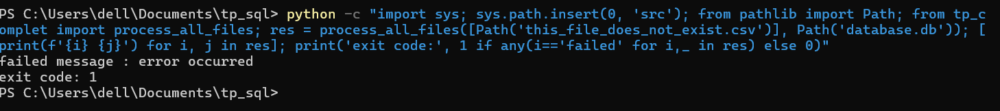
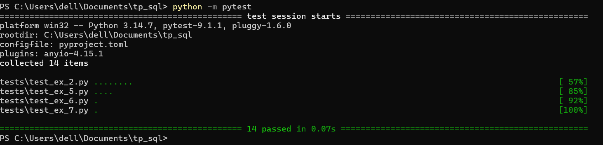
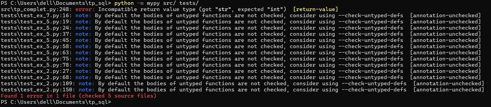

# Structure du projet 
(comme indiqué dans les contraintes)

src/  
	tp_complet.py

tests/  
	test_ex_2.py  
	test_ex_5.py  
	test_ex_6.py  
	test_ex_7.py  

pyproject.toml  

# Installation

pip install pytest mypy

# Commandes
installer pytest et mypy :  
pip install pytest mypy

pour générer les données et insérer en base (à lancer avant les tests) :  
python src/tp_complet.py

pour vérifier les types :  
python -m mypy src/ tests/

pour vérifier le fonctionnement du code à travers les tests :  
python -m pytest

# Schéma de la base de données

<u>table transactions</u> :

colonne | type 

id | integer 

datetime_transaction | text 

iban_origine |	text 

pays_source |	text

banque_source	| text 

iban_destinataire	| text	

pays_destinataire	| text 

montant	| text

devise	| text

<u> table processed_files </u> :

colonne | type 

id | integer 

file_hash | text unique

file_name |text

# Remarques :
Dans les codes des tests on a ajouté ces lignes :  
from pathlib import Path  
import sys  
sys.path.insert(0,str(Path(__file__).resolve().parent.parent/"src"))  

Cela permet d'importer tp_complet.py qui est dans "src" pour qu'on puisse lancer le code soit avec la commande ou directement depuis l'éditeur.

Dans le code de tp_complet.py, data et database.db vont être crées dans la racine du projet.

# Gestion des lignes invalides
Une ligne invalide est une ligne avec une colonne manquante, date invalide, montant qui ne peut pas être converti en decimal. Une ligne invalide est ignorée et n'est donc pas insérée dans la base de données. Cependant, on doit quand même la prendre en compte dans le compte des lignes invalides. J'ai choisi cette stratégie pour ne pas échouer tout le code à cause de quelques transactions invalides.

# Mécanisme d'idempotence
Un fichier ne doit pas être traité plus qu'une fois, pour éviter cela, on doit s'assurer qu'un fichier ayant le même contenu mais un nom différent ne soit pas traité une autre fois. Relancer le code une autre fois aussi ne doit pas permettre la réinsertion des données déjà traitées.
 Pour cela, on calcule le hash du contenu de chaque fichier avant son traitement, et on met le nom du fichier et son hash dans la table processed_files juste après son insertion réussie. Relancer le code une autre fois, ou injecter le même fichier avec un nom différent va engendrer seulement un texte "skipped" avec un message indiquant que ce fichier est "déjà traite" donc le code ne va pas le traiter ou l'insérer une autre fois.

# Question 6

**Pour la première partie de l'exercice 6**, j'ai essayé d'intégrer un fichier csv qui n'existe pas pour vérifier si le pipeline va ignorer le fichier non existant sans toucher les tables ou crasher avec une erreur. Les tables n'ont donc pas été affectées.

En effectuant un test on trouve :

PS C:\Users\dell\Documents\tp_sql> python -c "import sys; sys.path.insert(0, 'src'); from pathlib import Path; from tp_complet import process_all_files; res = process_all_files([Path('this_file_does_not_exist.csv')], Path('database.db')); [print(f'{i} {j}') for i, j in res]; print('exit code:', 1 if any(i=='failed' for i,_ in res) else 0)"
failed message : error occurred
exit code: 1

Le code a retourné 1 donc ç'a bien marché avec un message indiquant qu'il y avait un problème (csv n'existe pas). Que la base reste inchangée est vérifié automatiquement par test_ex_6 qui compare le nombre de lignes dans transactions avant et après cet appel.

**Pour la 2eme partie de cette question**, on a provoqué une erreur, où dans la fonction check_file dans le code tp_complet (dans src) j'ai changé le type de sortie de cette fonction de str à int.

On a testé avec pytest et on trouve ce résultat :

PS C:\Users\dell\Documents\tp_sql> python -m pytest
================================================= test session starts =================================================
platform win32 -- Python 3.14.7, pytest-9.1.1, pluggy-1.6.0
rootdir: C:\Users\dell\Documents\tp_sql
configfile: pyproject.toml
plugins: anyio-4.15.1
collected 14 items

tests\test_ex_2.py ........                                                                                      [ 57%]
tests\test_ex_5.py ....                                                                                          [ 85%]
tests\test_ex_6.py .                                                                                             [ 92%]
tests\test_ex_7.py .                                                                                             [100%]

================================================= 14 passed in 0.07s ==================================================
PS C:\Users\dell\Documents\tp_sql>

Donc pytest n'a pas capté cette erreur, cependant, quand j'ai testé avec mypy on trouve ce résultat :

PS C:\Users\dell\Documents\tp_sql> python -m mypy src/ tests/
src\tp_complet.py:248: error: Incompatible return value type (got "str", expected "int")  [return-value]
tests\test_ex_7.py:16: note: By default the bodies of untyped functions are not checked, consider using --check-untyped-defs  [annotation-unchecked]
tests\test_ex_5.py:19: note: By default the bodies of untyped functions are not checked, consider using --check-untyped-defs  [annotation-unchecked]
tests\test_ex_5.py:24: note: By default the bodies of untyped functions are not checked, consider using --check-untyped-defs  [annotation-unchecked]
tests\test_ex_5.py:37: note: By default the bodies of untyped functions are not checked, consider using --check-untyped-defs  [annotation-unchecked]
tests\test_ex_5.py:45: note: By default the bodies of untyped functions are not checked, consider using --check-untyped-defs  [annotation-unchecked]
tests\test_ex_5.py:58: note: By default the bodies of untyped functions are not checked, consider using --check-untyped-defs  [annotation-unchecked]
tests\test_ex_5.py:63: note: By default the bodies of untyped functions are not checked, consider using --check-untyped-defs  [annotation-unchecked]
tests\test_ex_5.py:75: note: By default the bodies of untyped functions are not checked, consider using --check-untyped-defs  [annotation-unchecked]
tests\test_ex_5.py:78: note: By default the bodies of untyped functions are not checked, consider using --check-untyped-defs  [annotation-unchecked]
tests\test_ex_2.py:27: note: By default the bodies of untyped functions are not checked, consider using --check-untyped-defs  [annotation-unchecked]
tests\test_ex_2.py:68: note: By default the bodies of untyped functions are not checked, consider using --check-untyped-defs  [annotation-unchecked]
tests\test_ex_2.py:109: note: By default the bodies of untyped functions are not checked, consider using --check-untyped-defs  [annotation-unchecked]
tests\test_ex_2.py:150: note: By default the bodies of untyped functions are not checked, consider using --check-untyped-defs  [annotation-unchecked]
Found 1 error in 1 file (checked 5 source files)
PS C:\Users\dell\Documents\tp_sql>

et comme cette ligne l'indique **"src\tp_complet.py:248: error: Incompatible return value type (got "str", expected "int")  [return-value]"** mypy a réussi à détecter l'erreur.

La différence entre pytest et mypy est que pytest vérifie que le code s'exécute correctement. Aucun des tests qu'on a fait vérifie si le type retourné par la fonction check_file est bien un str, donc pytest n'a pas détecté le problème. mypy cependant, vérifie les annotations de type et leur cohérence dans notre fichier.

Donc pytest vérifie que le code s'exécute et mypy vérifie que les annotations de type sont cohérentes.

**Remarque :** L'erreur qu'on a provoquée dans cette exercice a été corrigée après le test.

# Question 7

sqlite3.OperationalError justifie un retry parce que ça peut être un état transitoire et réessayer après quelques millisecondes peut fonctionner.

sqlite3.IntegrityError par contre, vient d'un problème dans les données elles-mêmes ou dans la logique du code et donc réessayer ne sert à rien et ne va rien changer. 

